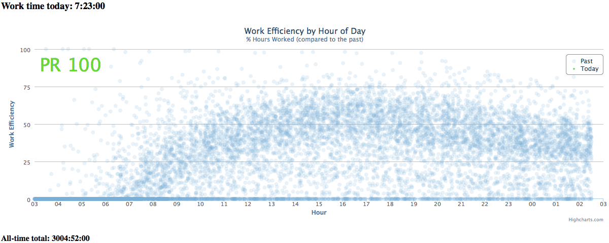

# Percentile Feedback

Percentile feedback implementation

## About

This tool allows you to:

- Log your time and track efficiency throughout the day
- Rank that efficiency against all previous days
- Do something about a low rank at any point (by logging more time)

In effect, this puts you in competition with all your past selves as you try to be more productive.

Here's what it might look like over the course of a day:



Based on [code by Nick Winter](http://www.nickwinter.net/codecombat-stats), made available under the Apache License 2.0.

Read more about percentile feedback on [Seth Roberts's blog](http://blog.sethroberts.net/category/percentile-feedback/).

## Questions

<dl>

<dt>What does "PR 50" mean?</dt>

<dd><p>PR is short for percentile rank. If you are at the 50th <a href="http://en.wikipedia.org/wiki/Percentile_rank">percentile rank</a>, your efficiency today is greater than or equal to 50% of your previous days.</dd>

<dt>Why am I at the 50th percentile rank when I very nearly beat my most productive day so far?</dt>

<dd><p>Imagine that you're competing in a race with two other people. Whatever order you all finish in, the positions are 1st, 2nd, and 3rd. If you win by just one second, you still get the gold medal for coming 1st, just as you do when you beat your closest competitor by several minutes.

<p>Now, imagine if instead of ranks such as "1st" and so on, we mapped these into percentages instead. 1st becomes 100%, 2nd becomes 50%, and 3rd becomes 0%. This is why if you logged two previous days, and then very nearly beat your most productive day on the third day, your percentile score will be 50%. Even though you came very close, you're still 2nd!

<p>So, why not just say "2nd" instead of 50%? Well, think about what happens when you log more days. Imagine that on the 5th day, you have your least productive day so far, and so you're 5th. In this case, "5th" means last. Now imagine that after logging 60 days, you come 5th. In this case, 5th is one of your most productive days! In other words, if you come 5th in a race with only five people in it, then you're last. If you came 5th in a race with 60 people in it, then you did quite well. In fact, you finished in the top 91.67% of all competitors. This is your percentile rank.

<p>Percentile ranks are therefore not dependant on the number of competitors. And as you compete against more of your previous scores, your rank will begin to appear more precise.</dd>

<dt>Why are past data points spaced irregularly? This doesn't look like my data.</dt>

<dd><p>Past data points do not directly correspond to the time periods you logged. Instead, they are samples. They show you where the green line would have been at that particular time on that particular day, even if you did not log anything at that time.

<p>They are spaced irregularly so that we are sampling as many different points along the x-axis as possible. If we sampled at regular intervals, our past data would stack up in 24 evenly spaced columns. This can look strange when you only have a few days data, but as you start to add more data, you'll see how the dots start to cluster in meaningful ways.</dd>

<dt>What is custom midnight?</dt>

<dd><p>By default, each new day (and hence the graph origin) starts at midnight.

<p>If you typically wake up at 8am, the first 8 hours of your graph are going to show zero hours worked. And when you finally start working, your efficiency score is going to be very low. Conversly, if you're a bit of a night owl, any work you do after midnight is going to show up on the next day's graph.

<p>To get around this problem, you can specify a custom midnight. Say, 6am. This marks the point you <em>actually</em> consider it to be a new day.</dd>

</dl>

## Running

### File

Load `index.html` in your browser.

The HTML will run as long as there as a `data.js` file.

This file can be created however you like. At the moment, there are only a handful of ways provided. But if there's something you'd like to use this with, create an issue, or submit a pull request!

### Server

Accessing the HTML via a `file` URI scheme does not work for some things. If you're facing this problem, you can set up a simple server.

Copy `local.pfserver.plist.tpl` to `local.pfserver.plist` and edit. Replace `PATH` with the path to the directory containing your `index.html` file.

Load the configuration by running:

```
launchctl load local.pfserver.plist
```

Once loaded, you start the server by running:

```
launchctl start local.pfserver
```

Consult the `launchctl` man page for more information. If you want the server to start on login, copy the `local.pfserver.plist` file to your `~/Library/LaunchAgents` directory.

## Adding Data

### Manual

Run `data.py --log-period SECONDS` to log `SECONDS` of time.

This command logs your data to the `periods.txt` file, which is authoritative record of your work time. Keep it safe. You can then run `data.py --convert-log periods.txt` to generate the `data.js` file.

If you're using a tool that is able to call a script with a number of seconds, this method will work for you. One example is a Pomodoro app that executes some AppleScript upon completion.

There is an app called [Timer](http://martakostova.github.io/timer/) that is able to run AppleScript.

The AppleScript might look something like this:

```
do shell script "/path/to/data.py --log-period 3600"
do shell script "/path/to/data.py --convert-log /path/to/periods.txt"
display notification "Logged 60 minutes of work!"
```

This logs a period of 3600 seconds (one hour) and displays a system notification.

If you are using a UNIX-like system, there may be similar things you can do. If you have a neat idea for this, please open an issue or submit a pull request!

### Emacs

If you use the clock feature of Org, you can parse an Org file and send this to the tool.

Your Org file will look like this:

```
* Sample Task
CLOCK: [2014-03-31 Mon 16:50]--[2014-03-31 Mon 17:32] =>  0:42
CLOCK: [2014-03-31 Mon 15:23]--[2014-03-31 Mon 15:51] =>  0:28
CLOCK: [2014-03-31 Mon 15:03]--[2014-03-31 Mon 15:10] =>  0:07
```

Run `data.py --convert-org FILE` to create the `data.js` file.

Alternatively, configure Emacs to run this command every time you save the file.

```lisp
;; Org clock percentile feedback integration

(setq my-org-file "/path/to/times.org")
(setq my-org-py "/path/to/percentile-feedback/org.py")

(defun process-org-file ()
  (when (string-equal (buffer-file-name) my-org-file)
    (shell-command (concat "python " my-org-py " --convert-org " my-org-file))
    (message "Processed org file")))

(add-hook 'after-save-hook 'process-org-file)
```

## Clients

### HTML Widget

You can use a HTML widget to display the graph wherever you can display widgets.

The OS X dashboard, for instance, allows you to clip a web page. [Mach Desktop](http://www.machsoftwaredesign.com/desktop.html) does something similar, but allows you to display a web page on your desktop.

This sort of thing increases the visibility of the graph, thereby increasing its motiviational power.

### Menu Bar

There is no OS X Menu Bar client right now, but this would be a good idea. Pull requests welcome!

### Google Chrome

There is an experimental Google Chrome extension that displays a live PR. Enable developer mode via the Chrome extensions page. Then load the `extension` directory as an unpacked extension.

## License

Licenced under the Apache License 2.0.

See [LICENCE.md](LICENSE.md) and [NOTICE.md](NOTICE.md) for more information.
